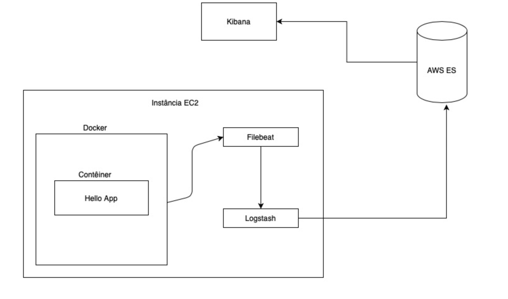

# Stack de monitoramento com ELK
Esse projeto provisiona um serviço Elasticsearch e uma instância EC2 com logstash com filebeat para coleta de logs de contêineres.

## Requisitos
* Terraform 0.14+
* Packer v1.7+
* Ansible 2.10+
* Credenciais de uma conta da AWS (access_key e secret_key)

## Como funciona

Esse projeto cria os seguintes recursos na AWS:
* Um serviço ElasticSearch;
* Uma AMI baseada em Ubuntu 18.04;
* Uma instância EC2 (com dois security groups: um para SSH e outro para HTTP)


A arquitetura final do projeto ficará da seguinte forma:



## Como executar

#### **Importante:** 
se quiser usar uma chave SSH para acessar a instância, é preciso fazer o seguinte:    
* alterar o valor da  variável `instance_key_name`  no arquivo `terraform/terraform.tfvars` para o nome da sua chave SSH **existente na aws**;
* descomentar a seguinte linha do arquivo `terraform/main.tf`:    
 `#key_name = var.instance_key_name`

### Passo a passo para executar

1. Usar as credenciais da aws em `~/.aws/credentials`, no formato:
```
[default]
aws_access_key_id = <minha_chave_de_acesso>
aws_secret_access_key = <minha_chave_secreta>
```

2. Criar a stack:   
`make create-infra`

> Esse processo vai demorar uns minutos, então é só pegar o café e aguardar ☕

Ao final será exibido um *output* com as seguintes informações:
* `kibana_endpoint`: URL para acessar o kibana (informações mais abaixo sobre como acessar)
* `public_ip`: endereço IP público da instância EC2 (vai ter uma aplicação executando na porta 80)

Para acessar o Kibana, o login é feito com as credenciais criadas em `terraform/terraform.tfvars`:

```
es_master_user_name     = "USER_INCRIVEL_AQUI"
es_master_user_password = SENHA_INCRIVEL_AQUI"
```
No Kibana, vai estar criado um índex no formato: `container-logs-%{+YYYY.MM.dd}`

> Se quiser inspecionar os *outputs* após o build, é só executar:   
`make show-output`

## Removendo os recursos 🔥
Para remover os recursos criados, executar:   
`make destroy-infra`
